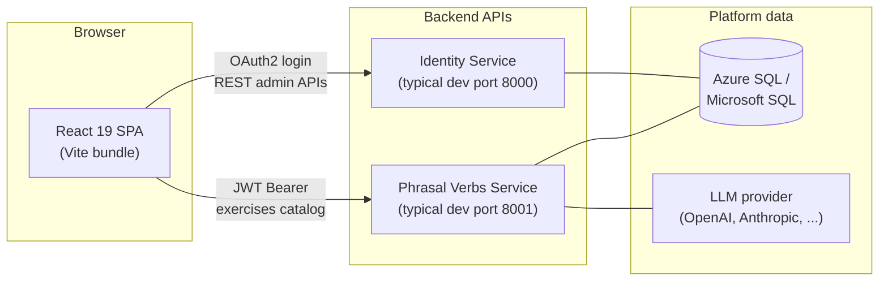
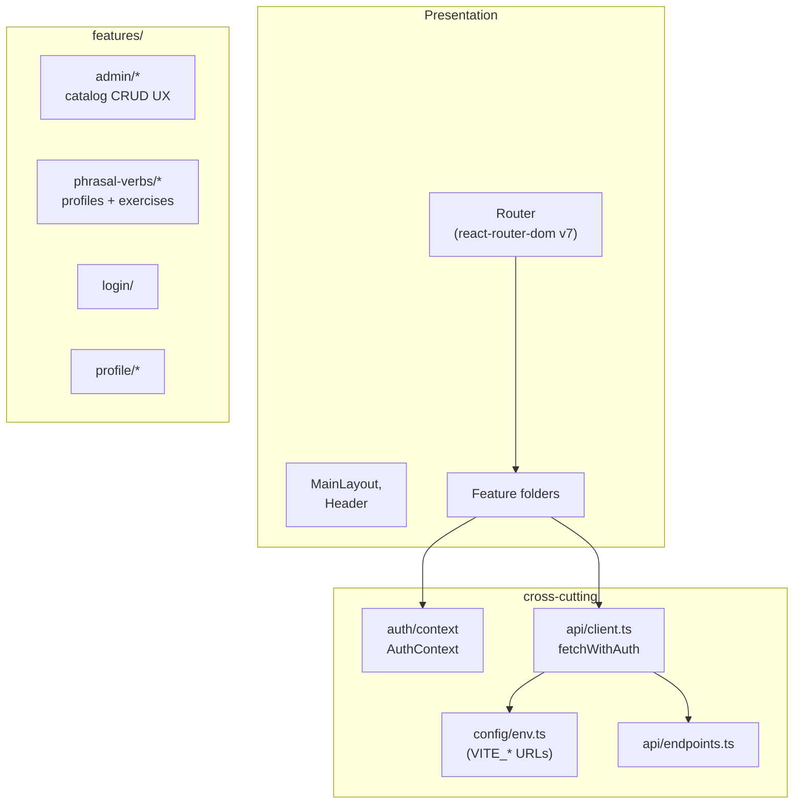

# LanguageApp Web

**React + Vite + TypeScript** single-page application for LanguageApp: **authentication**, **administration** (users, roles, permissions, services), and **phrasal verb learning** flows (profiles, exercises). It communicates with **`LanguageApp-IdentitySvc`** and **`LanguageApp-PhrasalVerbsSvc`** over HTTPS with **Bearer JWT** credentials after login.

---

## Role in the system



- **Identity** handles signup/login (password grant), issuing **JWT** access tokens and hosting identity administration.
- **Phrasal Verbs** enforces JWT-based **RBAC per service registration** (`roles` keyed by **`service_name`** in the token claims).
- This repo only contains the **presentation layer**: routing (**`react-router`**), **`fetch`** helpers, and **`AuthContext`** for token/session state.

---

## Architecture (inside this repo)



**Patterns**

| Area | Approach |
| --- | --- |
| **Folders** | **Feature-first** layouts under **`src/features/<area>/`**; shared pieces under **`src/shared/`**, layout under **`src/layout/`**. |
| **API base URLs** | **`src/config/env.ts`** exposes **`env.apiIdentityUrl`** and **`env.apiPhrasalVerbsUrl`** from **`VITE_API_IDENTITY_URL`** and **`VITE_API_PHRASAL_VERBS_URL`**. **`src/api/client.ts`** builds absolute URLs (**`identityUrl`**, **`phrasalVerbsUrl`**) and **`fetchWithAuth`** adds **`Authorization`** when needed. |
| **Auth gate** | **`ProtectedRoute`** plus **`AuthContext`** (React Context) wraps routes that require authentication. **`jwt-decode`** is available when parsing token payloads client-side. |
| **Styling** | **Tailwind CSS** (utility classes throughout components). |
| **Type safety** | **TypeScript** strict project references via **`tsconfig.app.json`** / **`tsconfig.json`**. |

---

## Prerequisites

- **Node.js** 18+ (22 LTS is fine).
- **npm** (bundled with Node) or **`pnpm`** / **`yarn`** if you swap lockfiles consciously.
- Running **backend** instances (or mocks) reachable at the **`VITE_*`** URLs configured for local dev.

---

## Environment variables

Create **`.env.local`** (ignored by Git) or `.env`:

| Variable | Example | Purpose |
| --- | --- | --- |
| **`VITE_API_IDENTITY_URL`** | `http://127.0.0.1:8000` | Base URL for **`LanguageApp-IdentitySvc`** (no trailing slash required; normalized in **`env.ts`**) |
| **`VITE_API_PHRASAL_VERBS_URL`** | `http://127.0.0.1:8001` | Base URL for **`LanguageApp-PhrasalVerbsSvc`** |

Vite exposes only **`VITE_`-prefixed** variables to **`import.meta.env`** (see **`src/vite-env.d.ts`** for typings).

---

## Install and run locally

```bash
npm install
npm run dev
```

Default URL: **`http://localhost:5173`** (Vite picks another port if occupied).

Production build:

```bash
npm run build
npm run preview
```

Lint:

```bash
npm run lint
```

---

## Tests

There is **no PyTest** in this frontend (Python tests apply to **`LanguageApp-IdentitySvc`** / **`LanguageApp-PhrasalVerbsSvc`** only).

To add client-side verification, common choices are:

- **Vitest** + **Testing Library** for components and **`fetch`** mocks.
- **Playwright** for end-to-end flows against **`npm run preview`** plus local APIs.

Manual smoke test checklist:

1. Start Identity + Phrasal Verbs backends with matching JWT configuration.
2. Set **`VITE_*`** URLs, run **`npm run dev`**, open `/login`.

---

## Working with backends

| Repo | Typical local command | Swagger |
| --- | --- | --- |
| **Identity Service** | `uvicorn main:app --reload --port 8000` | `/docs` |
| **Phrasal Verbs Service** | `uvicorn main:app --reload --port 8001` | `/docs` |

Ensure **CORS** on each API (**`CORS_ALLOW_ORIGINS`**) permits your web origin (**`http://localhost:5173`** by default).

Each backend README describes **Alembic**, **`.env`/`.env.template`**, and **PyTest** in detail.

---

## Debugging

### VS Code / Cursor

1. Run **`npm run dev`**.
2. Use **Chrome** debugger (F5) or attach configurations in **`.vscode/launch.json`** (example block below):

```json
{
  "version": "0.2.0",
  "configurations": [
    {
      "type": "chrome",
      "request": "launch",
      "name": "Launch Chrome against localhost",
      "url": "http://localhost:5173",
      "webRoot": "${workspaceFolder}/src"
    }
  ]
}
```

Use **Chrome DevTools** (F12) for network traces when diagnosing API mismatches (**401**, **403**, CORS).

---

## NPM scripts reference

| Script | Description |
| --- | --- |
| **`npm run dev`** | Vite dev server (HMR) |
| **`npm run build`** | **tsc -b && vite build** |
| **`npm run preview`** | Serve production build locally |
| **`npm run lint`** | ESLint on the codebase |
